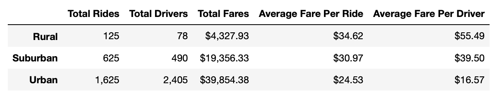

# PyBer Analysis

## Overview of Project

This analysis was created in order to analyze ride-sharing data by city type (Urban, Suburban, and Rural) for a company called PyBer. The summary of this report details the differences between the total fare prices between the three city types.

## Results

The results of this analysis are as follows:

## Summary
