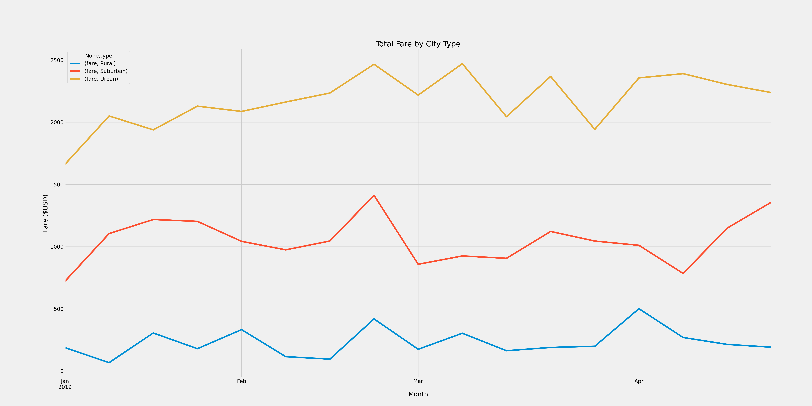

# PyBer Analysis

## Overview of Project

This analysis was created in order to analyze ride-sharing data by city type (Urban, Suburban, and Rural) for a company called PyBer. The summary of this report details the differences between the total fare prices between the three city types.

## Results

The results of this analysis are as follows:

The chart above was created in order to outline the average Urban, Suburban, and Rural city number of rides, costs, etc. There is an interesting correlation here, where the lower number of rides (specifically for Rural cities) yields more expensive fares for riders, and therefore a higher wage for the driver. The more rides and drivers there are, the cheaper it costs for riders to go places, but it also takes far more rides for the drivers to make additional money. 

It's interesting to look at this graph from the perspective of the second to last column, "Average Fare Per Ride", because even though the drivers make far less the more drivers and trips there are, the cost for any person taking a PyBer does not go down as significantly. It is still relatively cheaper to take PyBer in an urban environment, however, it is not as cheap as the difference between the wage a driver gets. 

The following chart shows a summary of fare cost vs certain months of the year, separated by the city types:

This chart continues to support the previous analysis, and also shows that the three different city types have similar patterns throughout the three months being examined. Although they are clearly in three different buckets as far as costs, they always stay in them and don't overlap, and also have generally similar dips and peaks in costs. The conclusion here is that seasonality affects all three categories similarly, but not to the point of them ever overlapping one-another, due to cost implications.

## Summary

Although it makes sense why there are disparaties in the data, it may be a better tactic to make urban costs a little bit cheaper for riders, and give drivers a bit more money per trip. PyBer makes most of it's money from the urban sector, however, those drivers get paid the least. The average fare per driver being at $16 for urban drivers vs $55 for rural drivers is a very big difference, and even making it $40 for rural and $25 for urban will make things better, and will most likely attract more urban drivers to the business.

Additionally, the average fare per ride doesn't necessarily make much sense, as there is an exponential difference between rural vs urban drivers, and not even close to that difference in the average ride fares. Although this data does not look at the specific distances covered in urban vs rural areas, and it is likely that people may travel farter in rural environments, the fare cost does not support the difference between 78 and 2,000+ drivers in the different regions. It will likely attract more customers to use the service if the fare is lowered - not necessarily proportionately to the increase in drivers, as that would disrupt the business - but even to the extent of a couple dollars. 

Lastly, it would be very helpful to analyze PyBer average costs compared with competitors. This can give the company an edge - paying drivers more in urban and suburban areas, and lowering costs for riders as well. Since the bulk of the money for the company comes from those two city types, more specifically the urban type, it would only make sense to find a competitive cost edge and attract the highest number of both drivers and riders to the service. This will push business growth and help with revenue in the long run. 
